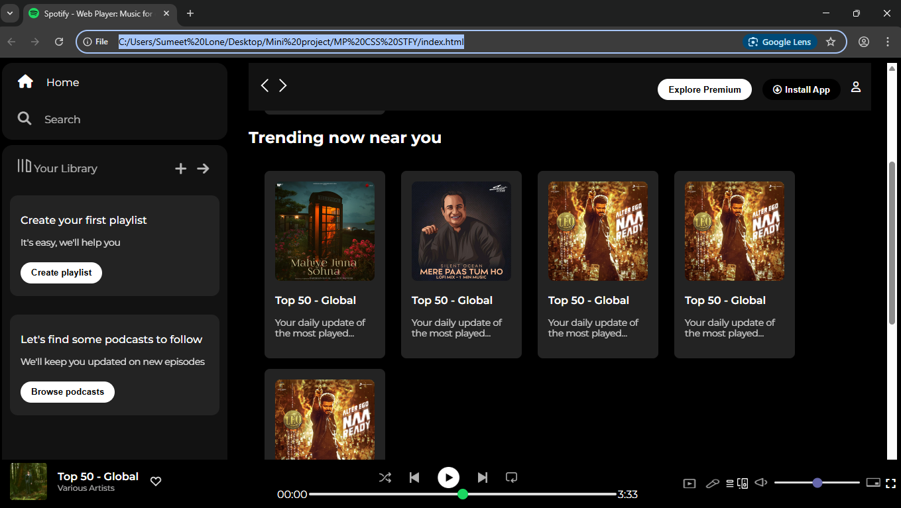

# 🎵 Spotify Clone

A lightweight, front-end clone of the **Spotify** web interface built using **HTML** and **CSS**.  
This project replicates Spotify’s layout and styling for learning and practice purposes — it does not include audio streaming or backend functionality.

---

## 📸 Preview
 <!-- Replace with actual screenshot path -->

---

## ✨ Features
- 🎨 **Pixel-perfect UI** inspired by Spotify’s official website  
- 📱 **Responsive design** for desktop and mobile screens  
- 🖱 **Hover effects** for interactive feel  
- 📂 Well-structured HTML and CSS for easy customization  
- 🖼 Organized `assets/` folder for images and icons

---

## 🛠 Tech Stack
- **HTML5**
- **CSS3**

---

